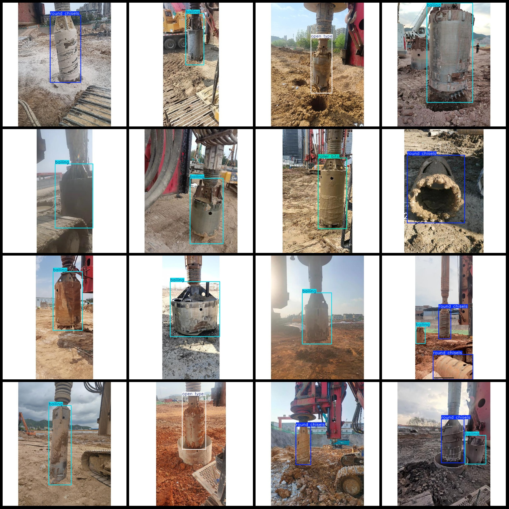
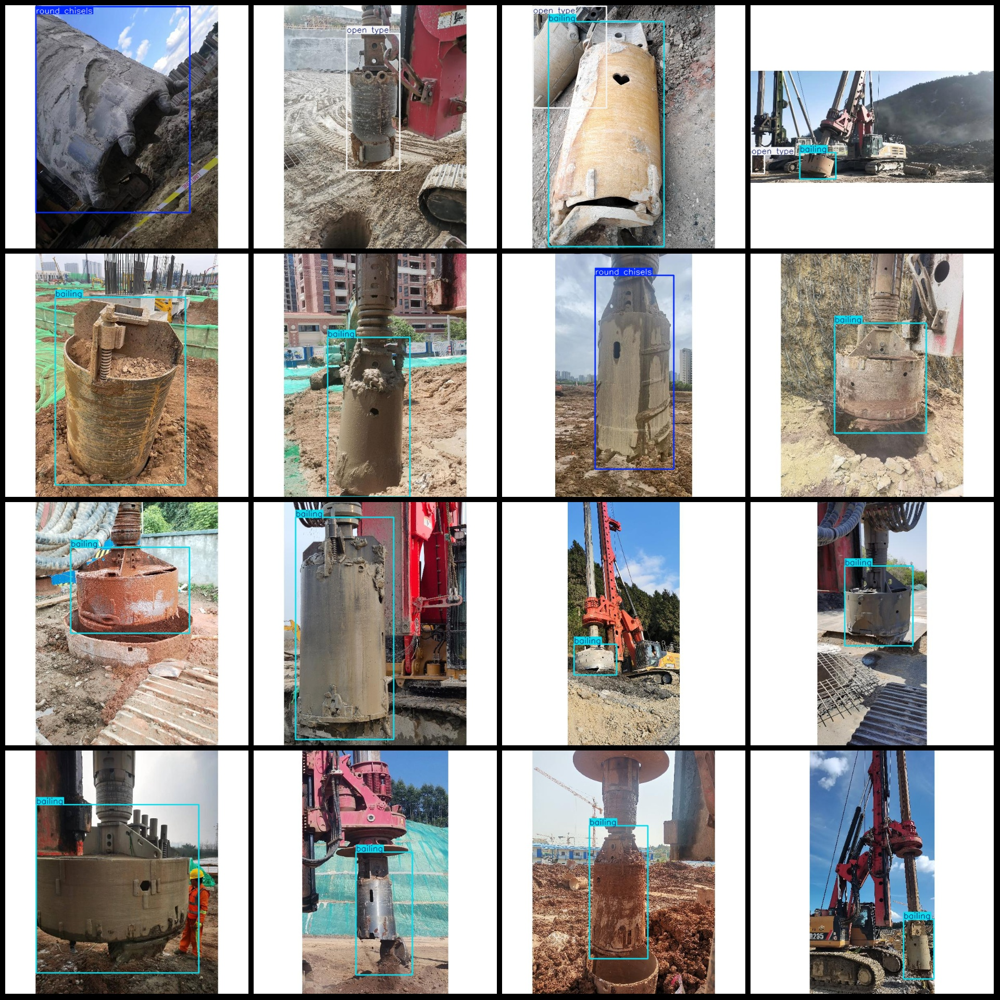

# Pascal VOC+YOLO format dataset: 2076 images in 4 categories

Dataset format: Pascal VOC format + YOLO format (without split path in txt file, only containing jpg images and corresponding VOC format xml files and yolo format txt files)
Number of images (jpg file count): 2076
Number of annotations (xml file count): 2076
Number of annotations (txt file count): 2076
Number of annotation categories: 4
Annotation category names (note that the order of categories in yolo format is not consistent with this, but refer to the labels folder's classes.txt for reference): ["bailing", "open type", "roller 
bits", "round chisels"]
Each category of annotations:
- bailing (drowing bucket) annotations = 1342
- open type (open type bit) annotations = 396
- roller bits (bit drill) annotations = 76
- round chisels (round chisel) annotations = 431
Total annotations: 2245
Number of images per category of annotations:
- bailing (drowing bucket) images = 1302
- open type (open type bit) images = 393
- roller bits (bit drill) images = 67
- round chisels (round chisel) images = 395
Image resolution: 600x600
Annotation tool used: labelImg
Annotation rule: draw rectangle boxes for each category
Important note: The dataset does not have been split into training, validation, or test sets; users must divide them themselves.
Special declaration: This dataset does not guarantee the accuracy of the models trained on it or the weight files.
Image preview:
Annotation example:

## Images

Here is a pay link on Stripe ( https://buy.stripe.com/3cs8yP7sY87d0vu9AB ). Please contact me lonlonago@foxmail.com after funding $89, and I will send you a complete data files , thank you!

